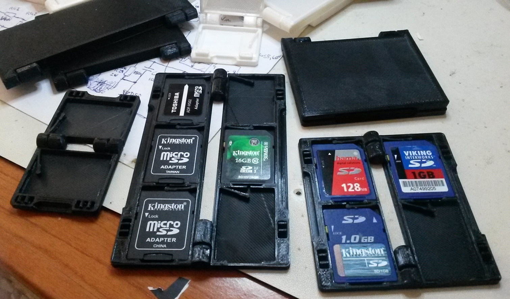
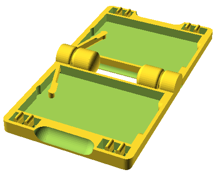
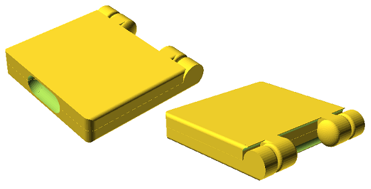
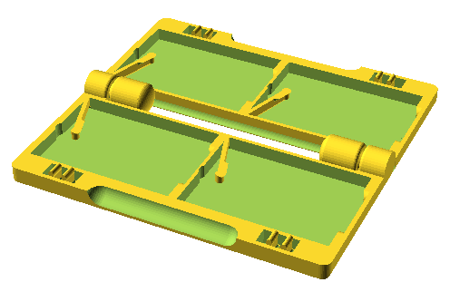
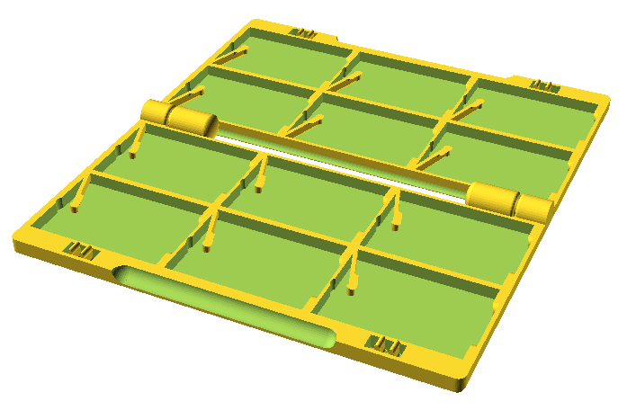
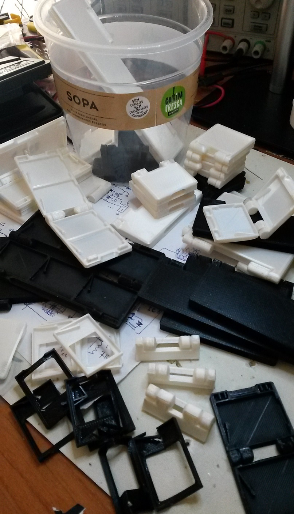

# 3D Printable SD Card Wallet Generator

OpenSCAD implementation of parametric SD Card wallets, designed with 3D printing in mind. I got inspired to design this after seeing, printing and liking Natalucciu's [SDCardWallet](https://www.thingiverse.com/thing:2995302). I liked it so much that I had to improve upon it to my liking :), by making it as *small / compact* as possible, adding a *wallet close lock* and making *several wallet configurations*. Although inspired by Natalucciu's project, my project was made entirely from the ground up.

Need to hold some Micro SD Cards too? Use a Micro SD Card to SDCard adapter or print [this one here](https://www.thingiverse.com/thing:3520171).

The STL output files for a few practical configurations are included, ready to be sliced and printed.

I exercised the lock mechanism more than 160 times on one of the prints, without any loss of functionality. The spring will give on the first usage but that's OK, it is expected.

Product development is a set of think - design - print - test iterations.

# Code Structure

The code consists of 3 layers, including 2 libraries that can be used in other projects:

* SDCardHolderLib.scad - Tiny single SD Card holder, featuring spring hold down and 2 opposite side chamfers to keep the card down.
* SDCardWalletLib.scad - Variable configurable SDCard wallet with print in place hinges and keep-closed locks.
* SDCardWalletXxY.scad - Implementation of SD Card wallets of several sizes. They set some configuration variables and use SDCardWalletLib.

If you want a different wallet confguration, create a new _SDCardWalletXxY.scad_ from one of the existing ones and tweak the variables for the configuration you desire. There are more variables that can be tweaked than the ones in the existing _SDCardWalletXxY.scad_ files, take a look at the beggining of file _SDCardWalletLib.scad_ to see what you can change.

# Printing Guidelines

Printing should be done with at least 0.2mm layer height, *no* supports.
Printing parameters depends alot on your slicer, printer and filament. In my tests I have used Ultimakercura 4.6.2, Creality Ender 3 Pro and [Tucab's Fil3D PLA 4032D](https://www.tucab.pt/en/Fil-3D/Filamentos-3D-PLA) filament. I manually optimized Cura settings for a much smaller printing time than the default Cura settings (Standard Quality 0.2mm) for my printer, but it should print just fine on the default Standard Quality.

The wallets are printed already assembled. Upon removal from the printer's bed, you just need to hold it with fingers near/on each hinge and force it slowly to close until it "breaks" and the hinge starts working. The SD Card springs also need to be gently pushed at the tip until they get free from ground.

Have fun :)
